# Estrutura Pedagógica: Apostila Figital de IA (4 Horas)
## Treinamento Corporativo Imersivo — GB Transportes

> **Público-Alvo:** Equipe interna (administrativo, operacional, logística e atendimento) — até 6 participantes  
> **Carga Horária:** 4 horas presenciais intensivas + suporte digital contínuo  
> **Conceito Didático:** *Phygital* (Apostila física encadernada + QR Codes com extensões multimídia em `menutela.com.br`)  
> **Objetivo Central:** Elevar em até 3x a agilidade na produção de relatórios, conferência de dados, redação de comunicados e resolução de problemas operacionais diários.

---

## 1. Princípios da Metodologia Phygital

1. **Apostila Física de Alto Impacto Visual:**
   * Design espaçado, tipografia legível, foco em clareza imediata e diagramas de fluxo.
   * Sensação tátil e psicológica de conclusão a cada capítulo ("Gatilho de Progresso").
   * Espaço dedicado para anotações individuais e desafios de aplicação direta nas rotinas da GB Transportes.

2. **Extensões Digitais via QR Codes:**
   * Cada seção contém um QR Code que direciona para o portal seguro (`menutela.com.br`).
   * Conteúdos digitais: micro-vídeos explicativos (1 a 3 minutos), áudios de reforço, prompts prontos para copiar e colar, infográficos interativos e modelos de planilhas.

---

## 2. Grade Horária e Módulos do Treinamento

```mermaid
gantt
    title Cronograma de 4 Horas Presenciais - GB Transportes
    dateFormat HH:mm
    axisFormat %H:%M
    section Módulo 1
    Desmistificando a IA no Transporte & Logística :09:00, 50m
    section Módulo 2
    Engenharia de Prompt Operacional & Comunicação :09:50, 50m
    section Intervalo
    Coffee Break Estratégico :10:40, 15m
    section Módulo 3
    Automação de Rotinas e Análise de Planilhas :10:55, 55m
    section Módulo 4
    Laboratório Prático & Avaliação Individual :11:50, 70m
```

---

### Módulo 1: Desmistificando a IA no Transporte de Cargas (50 min)
* **Objetivo:** Eliminar o medo tecnológico e entender a IA como copiloto de produtividade diária.
* **Tópicos:**
  - O que é e o que não é IA generativa na prática logística.
  - As grandes vantagens competitivas para transporte rodoviário e armazenagem.
  - Segurança de dados empresariais: o que pode e o que nunca deve ser inserido em modelos públicos.
* **Atividade Prática:** Primeiro diálogo estruturado com a IA para diagnóstico de gargalos operacionais.
* **Recurso Phygital (QR Code):** Vídeo de 2 min: *"Os 5 Mandamentos da Privacidade de Dados em IA Corporativa"*.

---

### Módulo 2: Engenharia de Prompt para Comunicação Ágil (50 min)
* **Objetivo:** Capacitar a equipe a redigir e-mails, notificações de frete, respostas a clientes e negociações com clareza e velocidade 5x superior.
* **Tópicos:**
  - A anatomia de um prompt profissional (Contexto, Papel, Tarefa e Formato).
  - Como lidar com clientes difíceis e ocorrências de carga usando respostas diplomáticas geradas por IA.
  - Resumos executivos de ordens de serviço e mensagens de WhatsApp em 5 segundos.
* **Atividade Prática:** Exercício "Redução de Ruído": transformar uma reclamação de atraso em uma solução construtiva e empática com IA.
* **Recurso Phygital (QR Code):** Biblioteca de 20 Prompts Prontos para Atendimento e Suporte GB Transportes.

---

### *Intervalo / Coffee Break Estratégico (15 min)*

---

### Módulo 3: Análise de Planilhas, Relatórios e Tomada de Decisão (55 min)
* **Objetivo:** Usar IA multimodal para interpretar dados de frete, custos de manutenção e métricas de desempenho sem fórmulas complexas.
* **Tópicos:**
  - Como ler planilhas de custos e rotas através de IA.
  - Identificação visual de discrepâncias em notas fiscais e relatórios operacionais.
  - Criação rápida de relatórios semanais de status para a diretoria (Anderson e Débora).
* **Atividade Prática:** Análise simulada de uma tabela de despesas operacionais para encontrar oportunidades de economia de combustível e tempo.
* **Recurso Phygital (QR Code):** Template de Relatório Semanal Automatizado para Gestão.

---

### Módulo 4: Laboratório "Mão na Massa" & Avaliação de Desempenho (70 min)
* **Objetivo:** Aplicação real em um problema vivo da GB Transportes e validação do nível de aprendizado de cada colaborador.
* **Dinâmica:**
  - Cada participante escolhe uma tarefa real do seu dia a dia que consome muito tempo e constrói seu fluxo de automação assistida por IA.
  - Apresentação rápida (3 min por aluno) do resultado obtido.
* **Avaliação de Eficiência:**
  - Teste prático individual de fixação.
  - Emissão de diagnóstico confidencial para Débora e Anderson apontando o perfil de rendimento, autonomia e pontos de melhoria de cada funcionário.
* **Encerramento:** Entrega simbólica de certificados e orientações para o suporte contínuo via plataforma.

---

## 3. Entregáveis do Projeto

1. **Apostilas Físicas Impressas:** 1 unidade encadernada e personalizada para cada colaborador participante.
2. **Acesso Vitalício ao Portal Didático:** Link direto para a esteira multimídia em `menutela.com.br`.
3. **Relatório Diagnóstico Executivo:** Dossiê exclusivo entregue à diretoria da GB Transportes com o mapeamento das competências e prontidão tecnológica da equipe.
