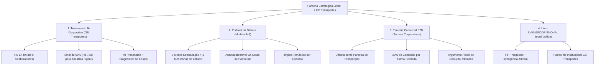

# JNE — Parceria Estratégica: Débora, Anderson & GB Transportes

> **Dossiê Executivo Consolidado e Diretrizes de Implementação**  
> **Metodologia:** JENIA (Jornada de Empreendedorismo, Negócios e Inteligência Artificial)  
> **Status:** Em Execução / Fase de Alinhamento e Produção  
> **Data-Base:** 16 de setembro de 2026  

---

## 1. Visão Geral da Parceria

Este repositório consolida todos os artefatos, acordos operacionais e estratégias comerciais firmados entre a consultora **Leomi Oishi** e os empresários **Débora e Anderson** (proprietários da **GB Transportes**).

O ecossistema de colaboração foi desenhado para aliar inteligência artificial prática, eficiência operacional e propósito ético/cristão, estruturando-se em **4 eixos sinérgicos e autossustentáveis**.

---

## 2. Os 4 Eixos Estratégicos

---

### Eixo 1: Treinamento Corporativo de IA (GB Transportes)
* **Objetivo:** Triplicar a produtividade operacional e a assertividade analítica da equipe interna da transportadora por meio de ferramentas práticas de IA.
* **Formato:** Imersão presencial intensiva de **4 horas** para até 6 colaboradores.
* **Investimento Especial PME:** **R$ 1.440,00** (aproximadamente R$ 240/aluno).
* **Condição de Pagamento:** Sinal de **50% (R$ 720,00)** via PIX para custear a diagramação e impressão gráfica das apostilas físicas personalizadas, e o saldo restante (R$ 720,00) pago na conclusão do treinamento.
* **Prazo de Produção do Material:** **10 dias úteis** a partir da confirmação do sinal.
* **Metodologia Phygital:** Apostila física de alta qualidade associada a QR Codes direcionados para a plataforma `menutela.com.br` com materiais complementares em áudio, vídeo e infográficos.
* **Garantia & Avaliação:** Avaliação prática individual confidencial ao término da formação, entregando à diretoria um raio-X das competências da equipe, acompanhada de garantia incondicional de retorno prático.

---

### Eixo 2: Produção Executiva do Podcast da Débora
* **Conceito:** Programa focado em empreendedorismo cristão, liderança feminina, superação e inteligência prática de negócios, ancorado na metodologia autoral **JENIA**.
* **Formato Operacional 3 + 1:**
  - **3 Meses de Estruturação e Produção:** Alinhamento editorial, roteirização de episódios, identidade visual, esteira de conteúdo e treinamento de oratória/câmera.
  - **1 Mês Bônus de Estúdio:** Gravação presencial em estúdio profissional em Arujá (custo estimado entre R$ 300 e R$ 500 por sessão).
* **Sustentabilidade Financeira:** Modelo 100% autossustentável bancado por cotas de patrocínio comercial, tendo a **GB Transportes** como patrocinadora âncora inicial.
* **Diferencial Competitivo:** Jingles temáticos exclusivos por episódio criados via Suno/áudio generativo, atuando como "teasers cantados" e ativos de alta viralidade nas redes sociais.

---

### Eixo 3: Parceria Comercial B2B (Expansão de Turmas)
* **Papel da Débora:** Atuação como parceira comercial conectando empresários da sua rede de relacionamentos para a contratação de treinamentos corporativos de IA.
* **Comissionamento:** **20% de comissão sobre o lucro líquido** de cada turma corporativa fechada e paga.
* **Pitch Comercial Principal:** Capacitação prática de funcionários, aumento de produtividade com inteligência artificial e enquadramento fiscal como despesa de treinamento/desenvolvimento de pessoas (dedutível no IRPJ/Lucro Real).

---

### Eixo 4: Livro e Metodologia "EVANGEDORISMO"
* **Conceito:** Metodologia e obra literária em coautoria com o **Pastor e Professor Jessé Odilon**, unindo os princípios inegociáveis do Evangelho, governança ética nos negócios e aplicação estratégica da inteligência artificial.
* **Conexão com a GB Transportes:** Convite para a GB figurar como patrocinadora institucional da edição, recebendo exemplares físicos personalizados para relacionamento com clientes corporativos e fornecedores estratégicos.

---

## 3. Cronograma de Ações Imediatas

| Fase | Ação | Responsável | Prazo / Status |
| :--- | :--- | :--- | :--- |
| **01** | Envio dos dados bancários (PIX) para sinal de R$ 720,00 | Leomi Oishi | D+0 |
| **02** | Confirmação do pagamento do sinal de 50% | GB Transportes | D+1 |
| **03** | Diagramação e impressão gráfica das apostilas físicas | Leomi Oishi | Janela de 10 dias |
| **04** | Agendamento oficial da data/horário da imersão presencial | Débora / Anderson | Durante a produção |
| **05** | Realização do treinamento de 4h e entrega do diagnóstico de equipe | Leomi Oishi | D+12 |
| **06** | Fechamento do naming definitivo e grade de cotas do Podcast | Débora e Leomi | Em paralelo |

---

## 4. Governança e Regras do Projeto

* Todas as decisões estratégicas e financeiras são validadas de forma transparente entre as partes.
* Nenhum material será veiculado ou impresso sem aprovação prévia dos envolvidos.
* As comunicações operacionais seguem o padrão de Economia de Tempo e Tokens (ETT).
